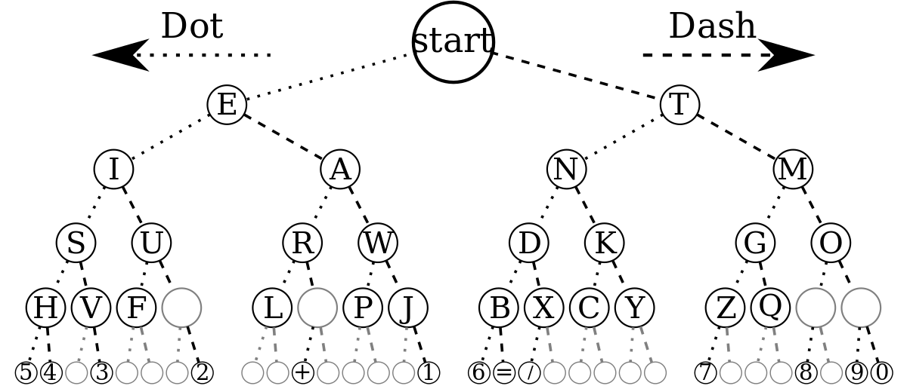

# GoMorse


Go library that enable to Encode/Decode Morse
## Installation
```Go
import (
 "github.com/MandelV/GoMorse"
)

```
## Usage

There are some methodes to Encode message to morse and Decode morse to plaintext
or get the letter of a given code and code for given letter

### To Encode

```Go
func Encode(message *string) (morse *string, err error)
```
Encode take a pointer to the text you want to Encode and return
a pointer of the morse and an err
if the Encode is success err will be nil
if the Encode is fail morse wil be nil and err will be return


### To Decode

```Go
func Decode(morse *string) (message *string, err error)
```
Decode take a pointer to the morse you want to Decode and return
a pointer of the message and an err
if the Decode is success err will be nil otherwise
message wil be nil and err will be return


### Get Letter of given morse code

```Go
func (tree *Tree) GetLetter(morse string) (letter string, err error)
```
Get the letter against its morse code
if GetLetter is success it return the letter and err'll be nil
otherwise letter will be empty and err wont be nil


### Get Code of given letter

```Go
func (tree *Tree) GetCode(letter string) (code string, err error)
```
Get the morse code against its letter
if GetCode is success it return the code and err'll be nil
otherwise code will be empty and err wont be nil


## Overview 

Internally the package represente the morse langage into Binary Tree :
```Go
//Tree represents the morse language
type Tree struct {
	Groot *Node
}
```
The tree contains nodes, each node represent a letter

```Go
//Node represent a letter in Tree
type Node struct {
	Dot    *Node
	Dash   *Node
	Letter string
}
```
To get the code of a letter you have to browse through the binary tree if the path goes left its a dot (.) otherwise its a dash (-)

Here a representation of the binary tree :



## TO-DO

- [Add the ability to manage empty nodes in the tree](https://github.com/MandelV/GoMorse/issues/1)